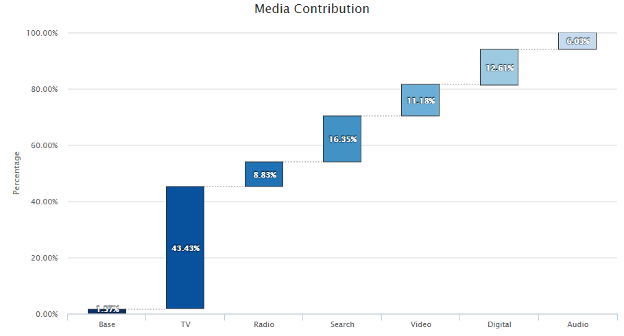

# ChartGallery
My Chart Collection (R)
* Source: rCharts, googleVis, Highcharter, etc.

```r
library(rCharts)
library(RColorBrewer)
library(highcharter)
```
### Set up Waterfall Chart function using highcharter package
```r

makeWaterfallHighcharter = function(data,customedColor ="Blues",titleText = "Variable Importance"){
  data$color = rev(colorRampPalette(brewer.pal(9,customedColor))(nrow(data)+2)[-c(1,2)])
  data = data %>% list.parse3()
  h1 = highchart() %>%
    hc_chart(type =  'waterfall') %>%
    hc_title(text = titleText ) %>%
    hc_xAxis(type = 'category') %>%
    hc_yAxis(
      title = list(
        text = 'Percentage'
      )
      ,max = 100
      ,labels = list(format = "{value:,.2f}%", useHTML = TRUE)
    ) %>%
    hc_legend(
      enabled = FALSE
    ) %>%
    hc_tooltip(
      pointFormat = '<b>{point.y:,.2f}%</b>'
    ) %>%
    hc_add_serie(
      data = data,
      dataLabels = list(
        enabled = TRUE,
        format = "{point.y:,.2f}%",
        style = list(
          color = '#FFFFFF',
          fontWeight = 'bold',
          textShadow = '0px 0px 3px black'
        )
      )
    )
  return(h1)
}

```

### Dummy Dataset
```r
firstSix = round(runif(7,1,100),2)
data = data.frame(
  name = c('Base','TV','Radio','Search','Video','Digital','Audio'),
  y = firstSix/sum(firstSix)*100,
  stringsAsFactors = F)
data
```

### Plot the waterfall chart with highcharter
__Theme: Blues__
```r
makeWaterfallHighcharter(data,customedColor = "Blues",titleText = "Media Comtribution")
```


__Theme: Reds__
```r
makeWaterfallHighcharter(data,customedColor = "Reds",titleText = "Media Comtribution")
```
__Theme: Greens__
```r
makeWaterfallHighcharter(data,customedColor = "Greens",titleText = "Media Comtribution")
```
